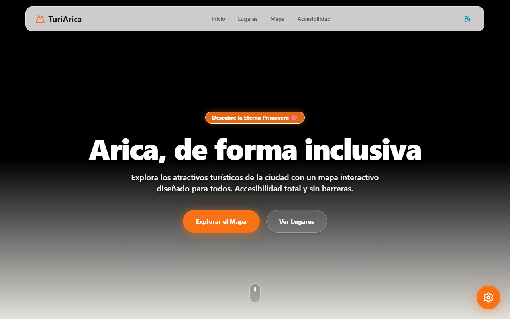
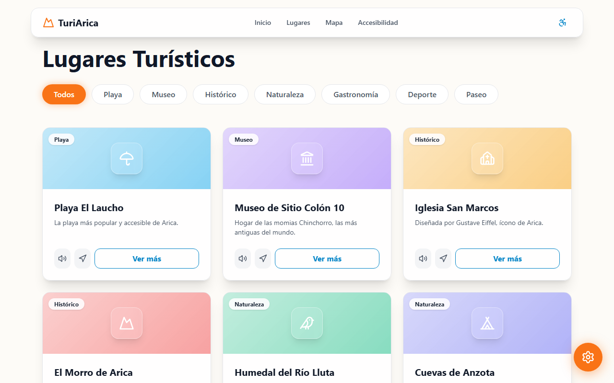
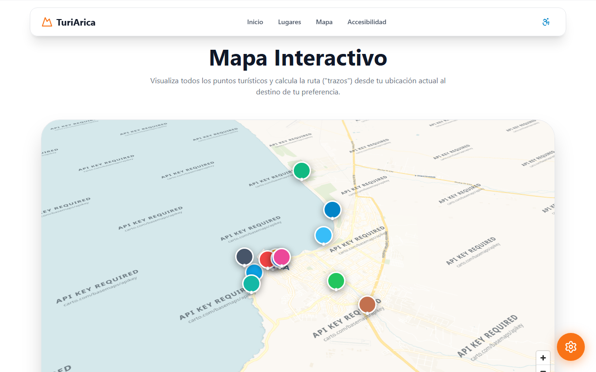
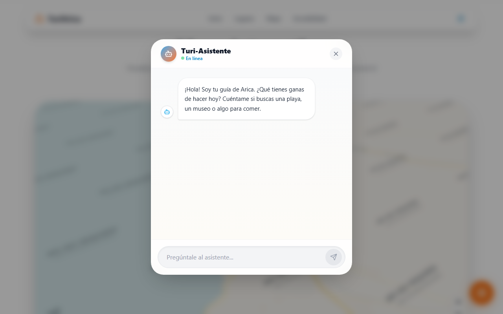

# TuriArica V2 🌸

Bienvenido al rediseño premium de **TuriArica**, una aplicación web interactiva e inclusiva diseñada para mostrar los atractivos turísticos de la ciudad de Arica (la ciudad de la Eterna Primavera) sin barreras tecnológicas.

## ✨ Características Principales

* **Diseño "Brutal" y Premium**: Interfaz moderna basada en *Glassmorphism*, paletas vibrantes ("Eterna Primavera"), y tipografías hermosas (`Inter` / `Outfit`).
* **Carrusel de Video Inmersivo**: El inicio de la aplicación cuenta con videos cinematográficos en alta calidad con transiciones suaves (crossfade) integrados con la temática de la ciudad.
* **Mapa Interactivo 3D (MapLibre GL)**:
  * Motor WebGL a 60 FPS.
  * Perspectiva 3D con inclinación (*Pitch*) y rotación.
  * Rutas calculadas dinámicamente con efecto de neón.
* **Turi-Asistente Inteligente**: Un chatbot flotante integrado para guiar al usuario a tomar decisiones sobre qué visitar.
* **Accesibilidad Universal (A11y)**:
  * **Text-to-Speech (TTS)**: Botones para leer descripciones o la página entera en voz alta.
  * **Audios Reales**: Reproducción de descripciones en MP3 (con fallback a TTS).
  * **Panel de Ajustes Rápidos**: Modificación del tamaño del texto y un **Modo de Alto Contraste (Modo Oscuro)** dinámico y sin filtros destructivos.
  * **Transporte**: Integración de micros y líneas de transporte público para cada destino.

[](https://react.dev/)
[](https://vitejs.dev/)
[](https://tailwindcss.com/)
[](https://maplibre.org/)
[](https://www.framer.com/motion/)
[](https://lucide.dev/)

## 🛠 Tecnologías Utilizadas

| Tecnología | Descripción | Insignia |
| :--- | :--- | :--- |
| **React 18** | Arquitectura modular de componentes y hooks reactivos |  |
| **Vite 6** | Bundler y servidor de desarrollo HMR ultrarrápido |  |
| **TailwindCSS v4** | Motor de estilos utilitarios modernos y modo oscuro |  |
| **MapLibre GL** | Motor cartográfico WebGL 3D a 60 FPS sin tokens |  |
| **Framer Motion** | Animaciones fluidas, transiciones de scroll y micro-interacciones |  |
| **Lucide React** | Pack de iconografía vectorial limpia y coherente |  |
| **GraphHopper API** | Cálculo de rutas y distancias en tiempo real |  |
| **Web Speech API** | Síntesis de voz (Text-to-Speech) nativa para accesibilidad universal |  |

---

## 📸 Vistazo a la Aplicación

### 🌟 Inicio Cinematográfico


### 🌓 Lugares Turísticos y Modo Oscuro


### 🗺️ Mapa Interactivo 3D (Rutas y Navegación)


### 💬 Turi-Asistente Inteligente


## 🚀 Instalación Local

Si deseas correr este proyecto en tu máquina local:

1. Clona el repositorio:
   ```bash
   git clone https://github.com/NicolasPonceH/TuriArica-V2.git
   ```
2. Instala las dependencias:
   ```bash
   npm install
   ```
3. Ejecuta el entorno de desarrollo:
   ```bash
   npm run dev
   ```
4. Abre `http://localhost:5173` en tu navegador.

---
*Desarrollado con ❤️ para Arica, Chile.*
